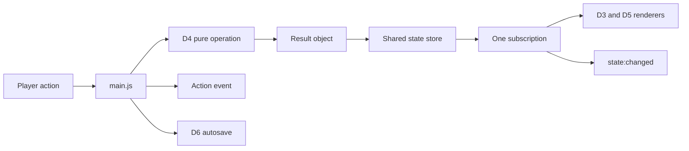

# Eco City — Integration Guide

Developer 1 delivers the master shell. The shared standard controls names, state shape and contracts. This delivery is runnable before Developers 2–6 arrive; it is not the finished ten-turn game.

## Delivered file tree

```text
eco-city/
├── .gitignore
├── index.html
├── package.json
├── package-lock.json
├── README_中文.md
├── INTEGRATION_GUIDE.md
├── MERGE_NOTES.md
├── CONTRIBUTION.md
├── VERIFICATION.md
├── src/
│   ├── main.js
│   ├── style.css
│   ├── core/
│   │   ├── gameState.js
│   │   └── eventBus.js
│   ├── data/buildings.js                   [D2 placeholder]
│   ├── city/
│   │   ├── cityGrid.js                     [D3 placeholder]
│   │   └── cityGrid.css                    [D3 placeholder]
│   ├── simulation/simulationEngine.js      [D4 placeholder]
│   ├── ui/
│   │   ├── dashboard.js                    [D5 placeholder]
│   │   ├── gameScreens.js                  [D5 placeholder]
│   │   └── ui.css                          [D5 placeholder]
│   └── storage/storage.js                 [D6 placeholder]
├── lead-tests/
│   ├── gameState.test.js
│   ├── eventBus.test.js
│   ├── browser-smoke.mjs
│   └── fixtures/
│       ├── simulation.js                   [test only]
│       └── storage.js                      [test only]
└── VERIFICATION.md
```

`node_modules/` and `dist/` are generated, ignored and excluded from delivery. No shared helper is needed, so `src/utils/helpers.js` is intentionally absent. D6's `tests/` can be added without changing the default `vitest run` script. Final teammate documents to add: `BUILDING_BALANCE.md`, `CITY_GRID_API.md`, `GAME_RULES.md`, `UI_API.md`, `TEST_PLAN.md`, `QA_CHECKLIST.md`, `EVIDENCE_GUIDE.md`, `DEMO_SCRIPT.md`.

## Ownership and exact destinations

All paths below are relative to the master `eco-city/` root. Each teammate copies only their files and adds their own `MERGE_NOTES.md` / `CONTRIBUTION.md` under a distinct handoff directory if collecting them centrally.

| Owner | Copy to master | Required accompanying document |
| --- | --- | --- |
| D1 — Lead | `index.html`, `package.json`, lockfile, `src/main.js`, `src/style.css`, `src/core/gameState.js`, `src/core/eventBus.js` | This guide and lead handoff docs |
| D2 — Buildings | `src/data/buildings.js` | `BUILDING_BALANCE.md` |
| D3 — Grid | `src/city/cityGrid.js`, optional `src/city/cityGrid.css` | `CITY_GRID_API.md` |
| D4 — Simulation | `src/simulation/simulationEngine.js` | `GAME_RULES.md` |
| D5 — UI | `src/ui/dashboard.js`, `src/ui/gameScreens.js`, `src/ui/ui.css` | `UI_API.md` |
| D6 — Storage and QA | `src/storage/storage.js`, `tests/` | `TEST_PLAN.md`, `QA_CHECKLIST.md`, `EVIDENCE_GUIDE.md`, `DEMO_SCRIPT.md` |

Do not overwrite another owner's implementation or replace the master `main.js`, state store, event bus or package manifest with a teammate's local demo. Never move test fixtures into `src/`.

## Exact ES-module contracts

Paths are relative to `src/main.js`. These are all required exports, even where the shell does not consume every helper yet.

```js
import { createInitialState, getState, setState, updateState, resetState, subscribe } from './core/gameState.js';
import { on, off, emit } from './core/eventBus.js';
import { BUILDINGS, getBuildingDefinition, getBuildingCost, canAffordBuilding,
  calculateBuildingImmediateEffect, getBuildingsByCategory, validateBuildingType } from './data/buildings.js';
import { createEmptyGrid, renderCityGrid, placeBuilding, removeBuilding,
  isCellEmpty, getBuildingAt, clearGrid } from './city/cityGrid.js';
import { calculateCityTotals, calculateEcoScore, applyBuildingPurchase,
  calculateTurnEffects, endTurn, checkGameOver, calculateFinalRating, validateState } from './simulation/simulationEngine.js';
import { renderResourceDashboard, updateResourceDashboard,
  getCityStatusMessage, renderBuildingInfo } from './ui/dashboard.js';
import { renderWelcomeScreen, renderHowToPlayScreen, renderGameOverScreen } from './ui/gameScreens.js';
import { saveGame, loadGame, hasSavedGame, deleteSavedGame, autoSave } from './storage/storage.js';
import './style.css';
import './city/cityGrid.css';
import './ui/ui.css';
```

The actual imports in `main.js` are the subset used by orchestration. A missing named export is an integration error, not something to silently suppress. If D3 does not supply CSS, retain the existing file (or replace its contents with a comment) so the static import resolves. D5 must provide `ui.css`.

### State store

`createInitialState()` returns the exact shared initial values and six distinct rows of six null cells. `getState()`, `setState()`, `updateState()` and `resetState()` return independent snapshots using `structuredClone`, available in the supported modern browser/Node environment.

`setState` validates all top-level fields, finite resources, turn 1–10, maxTurns 10, selection type, boolean gameOver, a dense 6×6 grid and the standard five-field building instances. IDs are unique and the grid and building list must agree by value. Economic bounds and recognized building types are D4's responsibility; the core deliberately does not invent an energy limit or scoring rule. Additional top-level fields are rejected to preserve the shared contract.

`updateState(partial)` shallow-merges approved fields and uses the same validation. Invalid updates throw `TypeError` before storage/notifications. `subscribe(fn)` returns an idempotent unsubscribe function and rejects non-functions. Every successful update notifies `(nextState, previousState)`, with separate deep copies for each listener. One failed listener is reported through `console.error`; others still run. Nested updates are queued so observers see ordered transitions. Subscribers should normally observe; do not create infinite write loops.

### Event bus and payloads

`on` deduplicates a callback per event and returns an unsubscribe function. `off` safely ignores absent registrations. `emit` snapshots the current listener set; changes during dispatch apply to the next dispatch. Listener exceptions are reported and do not block the remaining listeners. Unknown names in `on`/`emit` throw a `TypeError` to expose spelling mistakes. Event payloads are observational, shared by reference between event listeners, and should be treated as read-only; they never expose the private store itself.

| Event | Payload emitted by main |
| --- | --- |
| `state:changed` | `{ nextState, previousState }` |
| `game:started` | `{ state }` |
| `building:selected` | `{ type, state }` |
| `building:placed` | `{ building, state }` |
| `turn:ended` | `{ state, turnSummary, gameOver }` |
| `game:ended` | `{ state, finalResult }` |
| `game:reset` | `{ state }` |

State updates synchronously render through the single subscription, then emit `state:changed`; the action-specific event follows. A loaded completed game opens its result screen when Start is selected, without re-emitting an already-completed game's end event.

### Teammate return values and callbacks

- Building lookups in the temporary D2 module return `null` for unknown IDs, costs and effects; validation/affordability return `false`. Effects are new objects. The eight exact keys are `coalPlant`, `solarFarm`, `windTurbine`, `road`, `metro`, `park`, `residential`, `recyclingCentre`. D2 may remove the temporary `preview: true` flag; it is optional and only controls the card's neutral “Preview” label. All numeric values must come from `BUILDINGS`; absent `income` means zero.
- `renderCityGrid(container, state, { onCellClick, getBuildingDefinition })` renders only inside its mount. Native buttons handle mouse/Enter/Space in the temporary renderer. No global store import or cross-module DOM queries. Pure grid helpers never apply resources. D4's `applyBuildingPurchase` remains the only construction entry point used by main.
- `applyBuildingPurchase(state, type, row, col, BUILDINGS)` returns `{ ok, state, building?, error?, message }`. On failure the shell shows `message` without installing any state. D4 creates the standard unique-ID instance and synchronizes both grid/list.
- `endTurn(state, BUILDINGS)` returns `{ state, turnSummary, gameOver, finalResult }`. Main never increments turns itself. Only the placeholder adds `error: 'MODULE_PENDING'`; the real module need not implement any readiness flag. D4 applies turn 10, holds its displayed number at 10 and supplies the final rating. Happiness/CO2/Eco Score clamps and the energy bound belong in D4's documented rules.
- `renderResourceDashboard` is called once for the stable mount; subsequent changes use `updateResourceDashboard(container, state, previousState)`. `renderBuildingInfo` must handle a null definition. Screen callbacks are `{ onStart, onHowToPlay }`, `{ onBack }` and `{ onRestart }` for welcome, help and results. D5 focuses its own new heading or first control; main does not query screen internals.
- Storage is synchronous under the common contract. `loadGame()` returns valid state or null, and `hasSavedGame()` a boolean. To enable explicit error feedback, D6 should return `{ ok: true }` or `{ ok: false, message }` from save/autoSave/delete; boolean results are also accepted. If saves return void, main checks `hasSavedGame()` for status but cannot distinguish a failed overwrite from an earlier save. Agree on the explicit result before final merge. Use exactly `ecoCitySave` with `{ version: 1, savedAt: ISO timestamp, state }`; contain expected storage failures in the storage module.

## Stable DOM mounts

| Hook | Owner / purpose |
| --- | --- |
| `#app` | One root, D1 creates shell once |
| `#game-shell` | Main game view, hidden while a screen is active |
| `#screen-layer` | D5 welcome/how-to-play/game-over mount |
| `#resource-dashboard` | D5 resource bar |
| `#building-selector` | D1 cards generated only from BUILDINGS |
| `[data-building-type]` | D1 delegated card selection |
| `#city-grid` | D3 grid; focusable public mount |
| `#city-status` | D5 status text returned through main |
| `#building-info` | D5 selected-building details |
| `#game-feedback` | Accessible live success/error feedback |
| `#save-status` | D1 storage feedback |
| `#end-turn-button` | End-turn control |
| `#save-game-button` | Manual save control |
| `#reset-game-button` | Reset control |
| `#help-button` | Help from any view; Escape returns |
| `#city-heading`, `#map-hint`, `#land-count`, `#city-phase` | D1 headings/status/focus hooks |

Base CSS owns tokens and layout only. Temporary D3 styles use `.preview-grid` / `.preview-cell`; temporary D5 styles use `.preview-*`, `.welcome-*`, `.art-*`, `.screen-*`. Replace these with the owner's final CSS. Shared tokens: `--color-primary`, `--color-text`, `--color-muted`, `--color-surface`, `--color-border`, `--space-*`, `--radius-*`, `--shadow-soft`.

## Full orchestration flow

1. Create the store's initial state; request `loadGame`; structurally validate any loaded state. Build shell/cards once; subscribe once. Render the welcome screen.
2. Start renders resources/grid/details, shows the game and emits `game:started`. Starting a completed save opens its final screen.
3. Selection calls `updateState({ selectedBuilding: type })`, then emits `building:selected`. Cards persist in the DOM to retain keyboard focus.
4. D3 calls `onCellClick(row, col)`. Main guards game/view state and requires a selection, then delegates to D4. D4 validates funds/occupancy/type/coordinates and returns the complete result.
5. Success installs the returned state. The subscription renders and emits `state:changed`; main emits `building:placed`, shows feedback and calls `autoSave`. A failure shows the returned message with no mutation/save.
6. End Turn calls D4, installs the returned state, emits `turn:ended`, shows signed deltas and autosaves. If complete, emits `game:ended` and passes `finalResult` to D5. Main owns no scoring formula.
7. Save City calls `saveGame` and reports its result. Help hides the shell, leaves game state intact, and returns to the previous view with focus restored where possible.
8. Reset/Restart calls `resetState`, `deleteSavedGame`, emits `game:reset`, and consistently returns to welcome. It does not autosave the cleared state or register listeners again.



## Placeholder replacement checklist and merge order

Every temporary module has a `TEMPORARY PLACEHOLDER — REPLACE WITH DEVELOPER ... DELIVERY` header.

1. **D2:** replace `src/data/buildings.js`; verify eight IDs and all exports; remove preview-only metadata and zero fixtures; attach balance document.
2. **D3:** replace `src/city/cityGrid.js` and optional CSS; verify rendering from `cityGrid`, keyboard activation and pure helper results.
3. **D4:** replace `src/simulation/simulationEngine.js`; verify immutable results, unique IDs/fallback, resources, signed summaries, clamps, energy bounds, deterministic score and all five exact rating bands. Its temporary `validateState` currently returns `{ valid: false, errors: [...] }` and must not be used as a real validator.
4. **D5:** replace `dashboard.js`, `gameScreens.js`, `ui.css`; support null selection and all supplied callbacks; remove preview copy; retain mount boundaries, signed changes and focus behavior.
5. **D6:** replace `src/storage/storage.js`; agree on explicit mutation result objects; add final tests and QA documents. Test unavailable/full/corrupt/version-mismatched localStorage and malformed state.
6. **Final wiring:** verify exports/styles and result envelopes, remove all runtime placeholder markers, run checks below. Keep lead tests as supplemental or migrate with D6's agreement.

**Conflict rule:** retain the shared contract. Adapt local implementation details instead of renaming common APIs, events, state fields, building IDs or file paths. The fixed standard wins shared-interface conflicts; the role brief controls owned scope.

## Commands

```sh
npm install
npm run dev
npm test
npm run build
npm run preview
```

Use Node >=22.12; exact dependency versions are recorded in the package files. Optional lead browser checks need Playwright and an installed Edge browser: `node lead-tests/browser-smoke.mjs`, with the dev server at port 5173. `PLAYWRIGHT_MODULE` can point at an existing Playwright package and `ECO_CITY_URL` can change the server URL. See VERIFICATION for the exact tested setup. These tools are not application dependencies.

## Final integrated smoke checklist

- [ ] Install/test/build succeed; startup and interactions have no uncaught console errors.
- [ ] Welcome, Start, help/back/Escape, and completed-save resume work.
- [ ] All eight building IDs appear; real costs/effects come from BUILDINGS only.
- [ ] Selecting and activating an empty lot changes funds/grid/list exactly once.
- [ ] Invalid type/cell, occupied lot, unaffordable purchase and actions after game over fail safely.
- [ ] Ten End Turn actions apply effects exactly once; turn 10 stays at 10 and shows the exact final rating band.
- [ ] Resource values remain finite and within D4's documented bounds; score is deterministic.
- [ ] Save/reload/autosave, damaged/full/unavailable storage and reset/delete behave correctly.
- [ ] Repeat reset/start at least three times with no duplicate effects or events.
- [ ] Mouse and keyboard work; focus is visible; no horizontal overflow at 390px and 1366px.
- [ ] Screen reader labels/live feedback and signed resource deltas are present.
- [ ] Final screenshots and tests reflect the integrated game, not preview or test fixtures.

These boxes are deliberately left for the final integrated app. Lead-shell checks already executed are reported separately in `VERIFICATION.md`.
